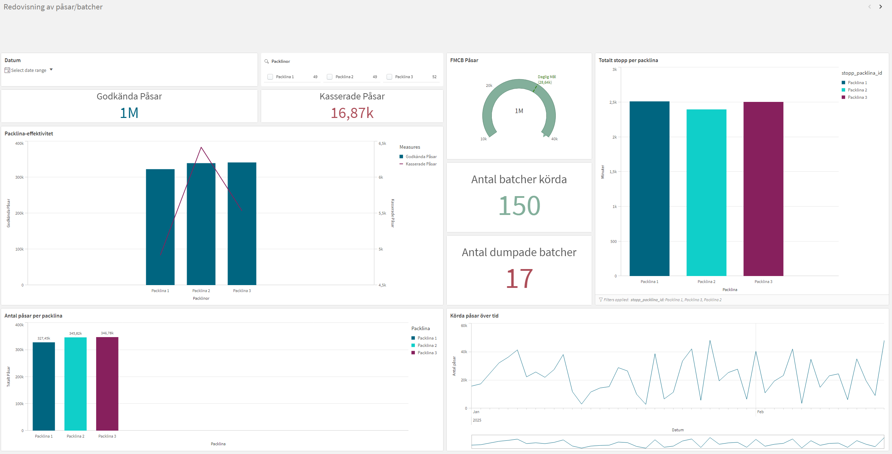
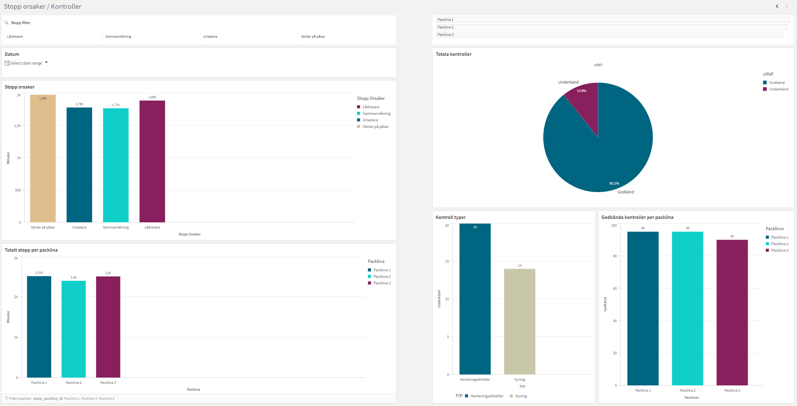

# 🏭 Produktion Visualisering 

Detta projekt är en simulering av produktionsdata för en paketeringsavdelning, där Python används för att skapa, testa och analysera data.  
Datan visualiseras sedan i **Qlik Sense** för att visa nyckeltal som produktionseffektivitet, stopporsaker och kvalitetsutfall.

---

## 📘 Syfte
Syftet med projektet är att visa hur Python kan användas för att:
- generera realistisk produktionsdata,  
- kvalitetssäkra data med automatiserade tester (*pytest*),  
- och skapa en grund för analys i Qlik Sense.  

Projektet återspeglar hur verkliga system, som **Pas-X**, hanterar produktionsinformation, fast i en förenklad och simulerad miljö.

---

## ⚙️ Struktur

```
│
├── data_raw/
│   ├── batcher.csv
│   ├── kontroller.csv
│   └── stopp.csv
│
├── generera_mock_pasx.py
├── generera_stopp.py
├── test_data_kvalitet.py
├── util/
│   └── util.py
│
└── README.md
```

---

## 🧩 Funktioner
- **Datagenerering:**  
  Python-skript som skapar batcher, kontroller och stopp baserat på slumpmässiga men realistiska värden.
- **Datavalidering:**  
  Automatiska tester i *pytest* som säkerställer datakvalitet (korrekta tider, inga överlapp, rätt summeringar).  
- **Loggning:**  
  Loggfiler som dokumenterar händelser och eventuella fel under körning.  
- **Visualisering:**  
  Data laddas in i **Qlik Sense**, där interaktiva dashboards visar produktionens nyckeltal.

---

## 🧠 Exempel på visualiseringar i Qlik Sense
- Totalt antal producerade påsar per packlina  
- Andel godkända och kasserade batcher  
- Vanligaste stopporsaker  
- Antal kvalitetskontroller per packlina  
- Datumfilter (dag, vecka, månad) för analys över tid  

*(Se rapporten för fullständig analys och skärmdumpar.)*

---

## 🧪 Tester
För att köra testerna, navigera till projektmappen och kör:
```bash
python -m pytest -q
```
Testerna kontrollerar:
- att varje batch har giltig start- och sluttid,  
- att godkända + kasserade = totalt antal påsar,  
- att inga stopp överlappar,  
- och att alla stopp ligger inom sin batchs tidsintervall.

---

## 📊 Visualisering
Data har importerats till Qlik Sense där flera diagram och KPI:er skapats för att visa resultatet.  
Visualiseringarna gör det möjligt att snabbt identifiera flaskhalsar, analysera stopp och följa produktionsflödet i realtid.

---
## 📊 Exempel på visualiseringar



